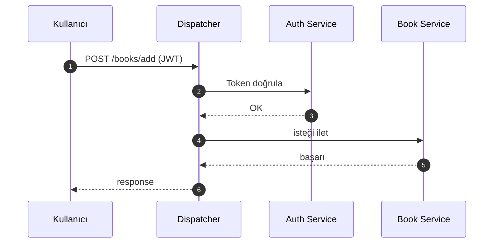
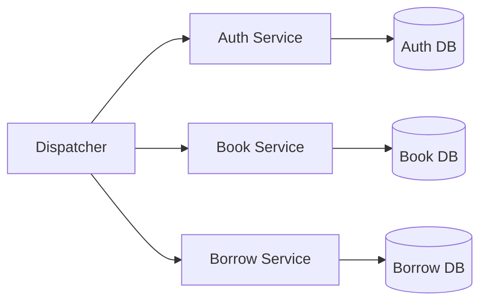
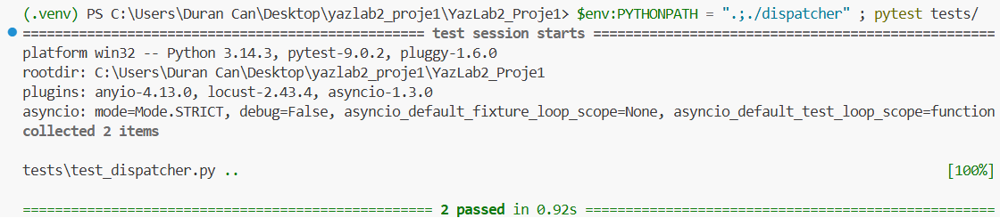
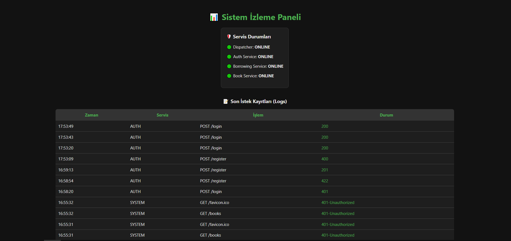
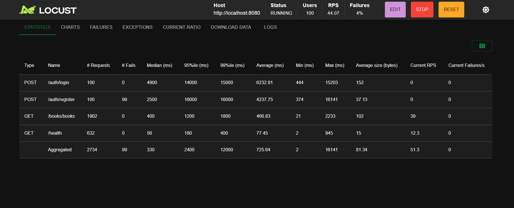
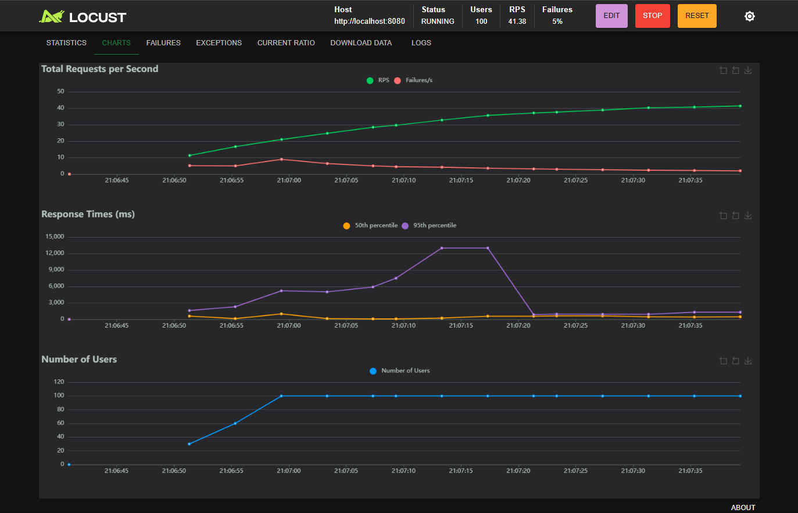
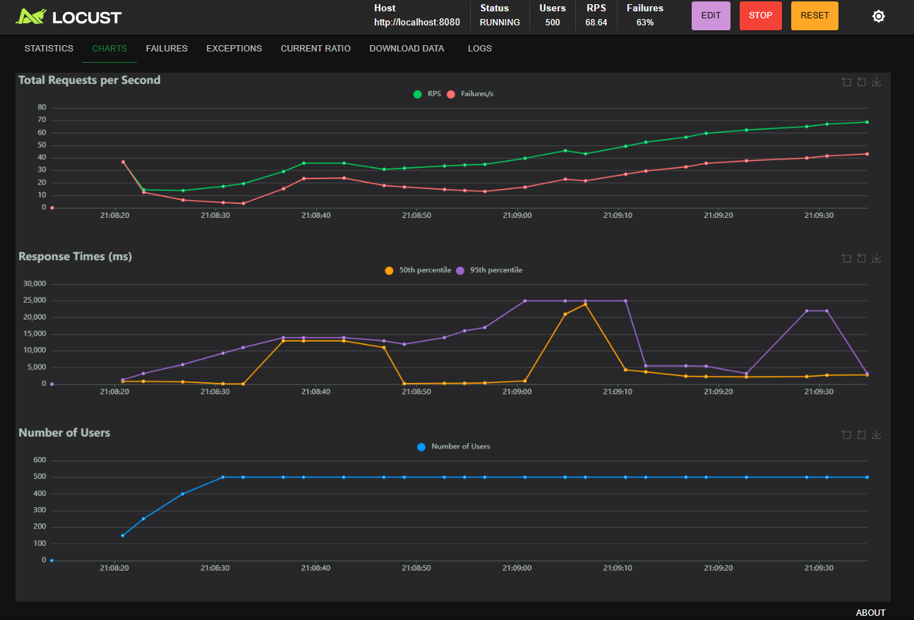

# 📚 Micro-Lib: Dağıtık Mikroservis Tabanlı Kütüphane Yönetim Sistemi


---
## Kurulum

```bash
git clone https://github.com/Durancan11/YazLab2_Proje1
cd YazLab2_Proje1
pip install -r requirements.txt
python main.py
```

---

## 🚀 Projeye Genel Bakış

**Micro-Lib**, mikroservis mimarisi kullanılarak geliştirilmiş, yüksek ölçeklenebilirliğe ve güvenliğe sahip bir **kütüphane yönetim sistemidir**. Sistem, monolitik yapıların dezavantajlarını ortadan kaldırmak amacıyla bağımsız servisler şeklinde tasarlanmıştır.

---

## Proje Bilgileri

* **Proje Adı:** Mikroservis Mimarisi ve API Gateway (Dispatcher)
* **Ekip:**

  * Duran Can Demirezen (211307037)
  * Ömer Şerif Yapıcıoğlu (211307062)
* **Tarih:** 4 Nisan 2026
* **Kurum:** Kocaeli Üniversitesi - Bilişim Sistemleri Mühendisliği - Yazılım Geliştirme Laboratuvarı II Proje I

---

## Proje Amacı

Bu projede:

*  Sistem çökmesini önlemek
*  Yüksek ölçeklenebilirlik sağlamak
*  Güvenli erişim kontrolü oluşturmak
*  Servis bağımsızlığını sağlamak

hedeflenmiştir.

---

## Problemin Tanımı

### Monolitik Sistem Sorunları

* Tek hata tüm sistemi etkiler 
* Güncelleme maliyetlidir 
* Ölçekleme sınırlıdır

### Mikroservis Çözümü

* Servisler ayrıştırıldı 
* API Gateway eklendi
* Sistem modüler hale getirildi 

---

## Kullanılan Teknolojiler

| Katman    | Teknoloji                |
| --------- | ------------------------ |
| Backend   | Python (FastAPI / Flask) |
| Database  | MongoDB (NoSQL)          |
| API       | RESTful                  |
| Auth      | JWT                      |
| Test      | Pytest                   |
| Load Test | Locust                   |

---

## API Endpointleri

| Endpoint         | Method | Açıklama         |
| ---------------- | ------ | ---------------- |
| `/auth/login`    | POST   | Kullanıcı girişi |
| `/auth/register` | POST   | Kullanıcı kayıt  |
| `/books`         | GET    | Kitap listeleme  |
| `/books/add`     | POST   | Kitap ekleme     |
| `/borrow`        | POST   | Kitap ödünç alma |

---

## Sistem Akışı (Sequence Diagram)



---

##  Mikroservis Mimarisi



---

##  Sistem Modülleri

| Modül           | Açıklama                         |
| --------------- | -------------------------------- |
| Dispatcher      | API Gateway, routing ve güvenlik |
| Auth Service    | JWT tabanlı kimlik doğrulama     |
| Book Service    | Kitap CRUD işlemleri             |
| Borrow Service  | Ödünç alma yönetimi              |
| Monitor Service | Loglama ve analiz                |

---

##  Karmaşıklık Analizi

* Routing: **O(n)**
* Veritabanı:

  * Ortalama: **O(1)**
  * En kötü: **O(log n)**

---

##  Testler ve Doğrulama

## Pytest Test Sonuçları

<p align="center">
  
</p>

> 📌 Tüm test senaryoları başarıyla geçmiştir.

---

### Monitor Paneli

<p align="center">
  
</p>

> 📌 Sistem trafiği ve loglar gerçek zamanlı izlenmektedir.

---

## Performans ve Yük Testleri

### 100 Kullanıcı (Stabilite Testi)

<p align="center">
  
</p>

<p align="center">
  
</p>

> 📌 %0 hata oranı ile stabil çalışma sağlanmıştır.

---

### 🔹 500 Kullanıcı (Stres Testi)

<p align="center">
  
</p>

> 📌 Sistem limit noktası belirlenmiş ve performans düşüşü gözlemlenmiştir.

---

## Başarılar

* ✔ Mikroservis izolasyonu sağlandı
* ✔ Güvenli API Gateway geliştirildi
* ✔ Merkezi loglama sistemi kuruldu
* ✔ Test odaklı geliştirme uygulandı

---

## Sınırlılıklar

* Gateway tek noktada darboğaz oluşturabilir
* Yüksek trafikte gecikmeler oluşabilir

---

## Gelecek Geliştirmeler

* Redis ile caching
* Kubernetes ile container orchestration
* Load Balancer entegrasyonu
* CI/CD pipeline kurulumu

---

