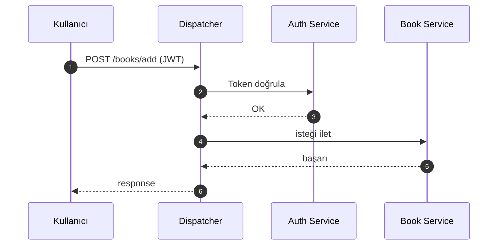
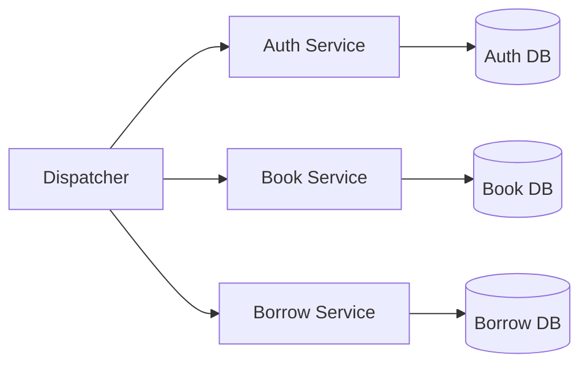

# 📚 Micro-Lib: Dağıtık Mikroservis Tabanlı Kütüphane Yönetim Sistemi

---

## Proje Bilgileri

* **Proje Adı:** Mikroservis Mimarisi ve API Gateway (Dispatcher)
* **Ekip:**

  * Duran Can Demirezen (211307037)
  * Ömer Şerif Yapıcıoğlu (211307062)
* **Tarih:** 4 Nisan 2026
* **Kurum:** Kocaeli Üniversitesi Bilişim Sistemleri Mühendisliği - Yazılım Geliştirme Laboratuvarı II

---

## Proje Amacı

Bu projede monolitik sistemlerin yerine **mikroservis mimarisi** kullanılarak:

* Sistem çökmesini önlemek
* Ölçeklenebilirlik sağlamak
* Güvenliği artırmak
* Servisleri birbirinden bağımsız hale getirmek

amaçlanmıştır.

---

## Problemin Tanımı

Monolitik yapılarda:

* Tek hata tüm sistemi çökertir ❌
* Güncelleme zor ❌
* Ölçekleme sıkıntılı ❌

Bu projede:
✔ Servisler ayrıldı
✔ Gateway eklendi
✔ Sistem modüler hale getirildi

---

## Kullanılan Teknolojiler

* Python (FastAPI / Flask)
* MongoDB (NoSQL)
* REST API
* JWT Authentication
* Locust (Load Test)
* Pytest (Unit Test)

---

## API Yapısı

| Endpoint       | Method | Açıklama         |
| -------------- | ------ | ---------------- |
| /auth/login    | POST   | Kullanıcı girişi |
| /auth/register | POST   | Kullanıcı kayıt  |
| /books         | GET    | Kitap listele    |
| /books/add     | POST   | Kitap ekle       |
| /borrow        | POST   | Kitap ödünç al   |

---

## Sistem Akışı (Sequence Diagram)

---

## Mikroservis Mimarisi

---

## Sistem Modülleri

* **Dispatcher:** tüm trafiği yönetir
* **Auth Service:** kullanıcı doğrulama
* **Book Service:** kitap işlemleri
* **Borrow Service:** ödünç sistemi
* **Monitor Service:** log ve analiz

---

## Karmaşıklık Analizi

* Routing: **O(n)**
* Database:

  * Ortalama: **O(1)**
  * Worst: **O(log n)**

---

## Testler

## Pytest Test Sonuçları

  

> 📌 Tüm testler başarıyla geçmiştir.

---

### Monitor Paneli (Loglama)

  

> 📌 Sistem trafiği anlık olarak izlenmektedir.

---

## Performans Testi (Locust)

## 100 Kullanıcı Testi

  

  

> 📌 %0 hata oranı ile stabil çalışmıştır.

---

### 500 Kullanıcı (Stres Testi)

  

> 📌 Sistem limit noktası gözlemlenmiştir.

---

## Başarılar

✔ Mikroservis izolasyonu
✔ Güvenli API Gateway
✔ Merkezi loglama

---

## Sınırlılıklar

* Gateway bottleneck olabilir
* Yük altında performans düşer

---

## Gelecek Geliştirmeler

* Redis Cache
* Kubernetes deployment
* Load Balancer
* CI/CD pipeline

---

## GitHub

Repo: https://github.com/Durancan11/YazLab2_Proje1

---
